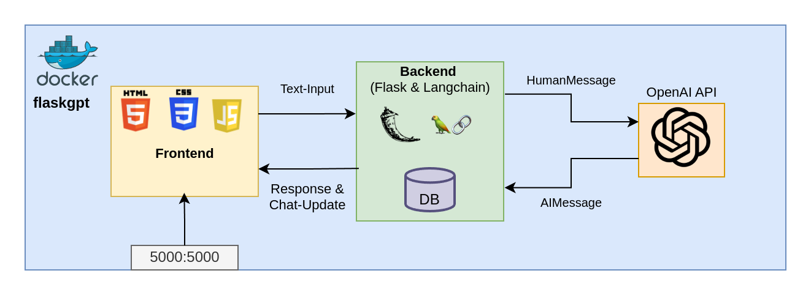
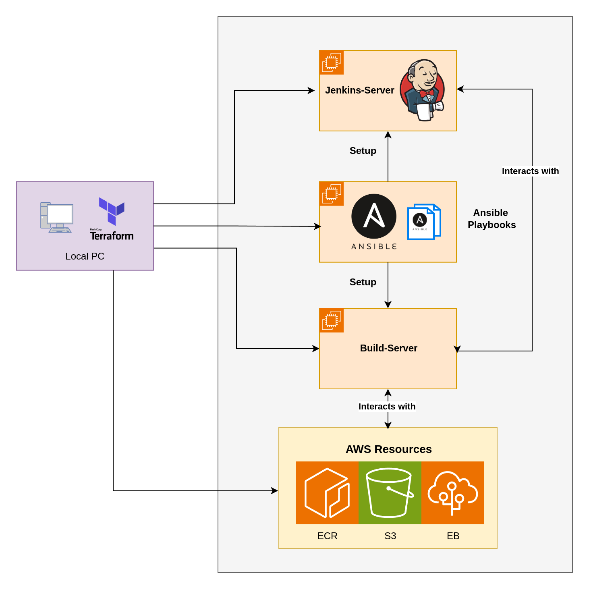
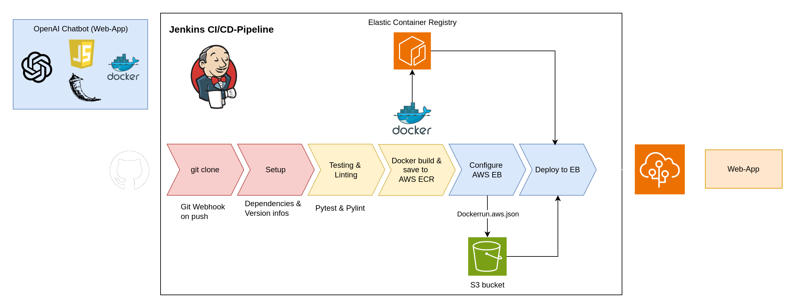

# Flask App with OpenAI-Chatbot deployed on AWS with DevOps pipeline

This is a OpenAI chat web application that uses flask as backend. The goal of this app is to be deployed to AWS.



1. Accessing the Web-App over port 5000 using `Gunicorn` / `Flask`
2. HTML, CSS and JavaScript frontend that allows sending chats to 
3. Sending Text to backend where it is wrapped in a `HumanMessage`-object from the Langchain library
4. Sending `HumanMessage`-object to the OpenAI API to get a an `AIMessage`-object with the answer
5. Saving both `HumanMessage`-request and `AIMessage`-response to SQLite database
6. Continuously updating the frontend using the database content.


## Running the app locally
Create and activate a virtual environment
```bash
python3.9 -m venv venv
source venv/bin/activate
```

Install dependencies
```bash
pip install -r requirements.txt
```

**(Optional): Creating a virtual environment with devops-related dependencies**
```bash
python3.9 -m venv venv-dev
source venv-dev/bin/activate
pip install -r requirements-dev.txt
```

Setting the OpenAI api key to access the llm:
```bash
export OPENAI_API_KEY=...
```

Run the app locally
```bash
python3 run.py
```
Open the app in the browser at http://localhost:5000 or https://127.0.0.1:5000
   
## Running the app locally with Docker
Building the docker container
```bash
VERSION=...
docker build --build-arg OPENAI_API_KEY=${OPENAI_API_KEY} -t flaskgpt:${VERSION} .
```
Running the app locally using Docker
```bash
docker run -it -p 5000:5000 flaskgpt:${VERSION}
```

## Demo

https://github.com/user-attachments/assets/d1ac5328-6175-409c-a1aa-887ecfb279ba


# Deploy the app on AWS using a CI/CD pipeline with Jenkins

The instructions can be found in the [devops](./devops/)-folder

**Requirements**:

- AWS account
- OpenAI account with sufficient credits and API token


## Creating Cloud resources



1. <u><b>Using Terraform to provision</b></u>
   - `Ansible-Server (EC2)`: Server for setting up build-server and Jenkins-server programs and dependencies (using Ansible-Playbooks)
   - `Jenkins-Server (EC2)`: For orchestrating the CI/CD-process in conjunction with the build-server
   - `Build-Server (EC2)`: Server that serves the Jenkins-server for everything related building, execution and deployment of code
   - `Elastic Container Registry (ECR)`: Used as artifact storage for dockerized code that was built in the Jenkins-pipeline
   - `S3 Bucket (S3)`: Storage for deployment configuration files of AWS Elastic Beanstalk (EB)
   - `Elastic Beanstalk (EB)`: Resource for deployment of code on AWS (requires S3 with config and ECR with dockerized program)

## The Jenkins Pipeline



**Steps of Pipeline**:
1. Clone Git repo on each git push (triggers webhook)
2. Setup `virtiualenv` with dependencies and obtaining version information from [`pyproject.toml`](pyproject.toml#3)
3. Testing and linting the webapp Python-code with Pytest and Pylint
4. Dockerizing the code and pusing it to AWS Elastic Container Registry (ECR) to be retrieved later in deployment
5. Dynamically creating AWS Elastic Beanstalk (EB) config (Deockerrun.aws.json) and saving it to dedicated S3 bucket
6. Deploying Docker container from ECR to EB
7. Access the OpenAI chatbot webapp with the URL that is provided by AWS EB
